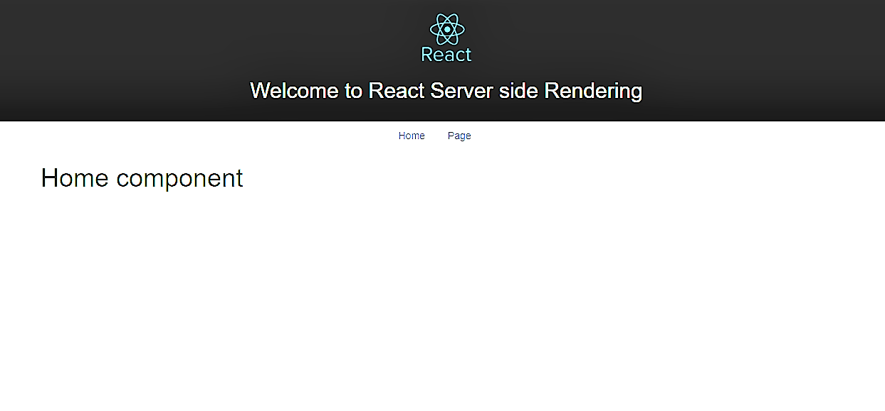

# React Redux Server Side Rendering with React Router Version 4

This project is a boilerplate created for use with React Redux and expressjs. It is designed to work with version 4 of react router. This implements server side rendering but at this stage does not use code splitting. Its aim is to improve SEO and can be used as a teaching aid to how react router implements its server render methods.

## Project View



```bash
git clone 
cd into folder
npm install
npm start opens development React Server Port 3000
```

## Build React Project

To run the project from the server in a server side render mode you are required to build your project as illustrated below.

```bash
npm run build
```

## Run Node Express Server

Once the build process is complete run the script below to serve your rendered React Redux project from Express.

```bash
npm run server - Port 8080

***This servers a rendered React Project from build files***
```

## Production
```bash
npm run production
```


## Acknowledgements

[Ben Lu](https://medium.com/@benlugit)

This project was Created with [Create React App](https://github.com/facebookincubator/create-react-app).

This project was bootstrapped with [Bootstrap](http://getbootstrap.com/).

The server was Scaffolded with [Express Generator](https://expressjs.com/en/starter/generator.html) 


For further information please refer to the links below

## Links 

[React Server Rendering Docs](https://reacttraining.com/react-router/web/guides/server-rendering)

[React Router Version 4](https://reacttraining.com/react-router/)

[Create React App](https://github.com/facebookincubator/create-react-app)

[Express js Server](https://expressjs.com/)

[Redux docs](http://redux.js.org/docs/introduction/)

[Redux with React Router](http://redux.js.org/docs/advanced/UsageWithReactRouter.html)

